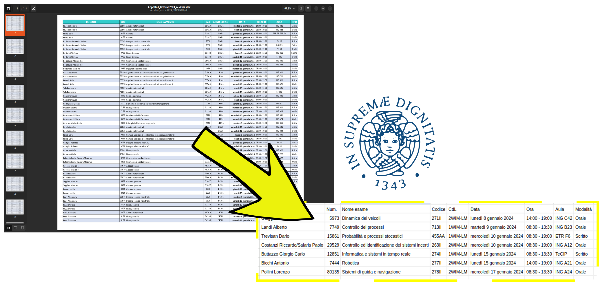
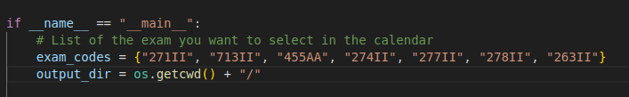
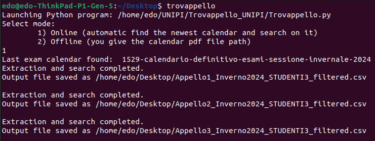
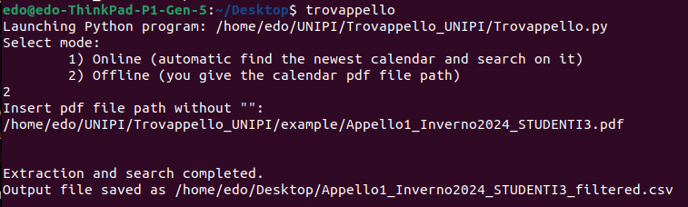

# Trovappello by Rimaturus

## [ENG] 
This script is used to filter the exams we have to administer from the list of all exams for each exam session. 
It has two modes:
1. **Online Mode**: It searches the university's website for the most updated list and saves the filtered results in a convenient .csv file.
2. **Offline Mode**: Similar to the online mode, but it filters the .pdf file of the list for which we provide the path.

## First setup:
Open a terminal and launch the file "first_install.sh" (this will check if all the needed dependencies are installed or install the missing ones)

## How to use it:
You can put the file "trovappello" wherever you want and launch it as "./trovappello" or simply add to the /usr/local/bin folder and launch easly from every terminal typing "trovappello". 
**Achtung: It will save the output files in the current directory (the one where you launch the command)**

To setup the exams that you are looking for, modify the list "exams_code" in the main file **Trovappello.py**

**Mode 1 (Online)**

**Mode 2 (Offline)**

## [ITA] 
Questo script è utilizzato per filtrare gli esami che dobbiamo amministrare dalla lista di tutti gli esami per ciascuna sessione d'esame. Ha due modalità:
1. **Modalità Online**: Cerca sul sito web dell'università l'elenco più aggiornato e salva i risultati filtrati in un comodo file .csv.
2. **Modalità Offline**: Simile alla modalità online, ma filtra il file .pdf dell'elenco per il quale forniamo il percorso.

## Prima configurazione:
Apri un terminale e avvia il file "first_install.sh" (questo verificherà se tutte le dipendenze necessarie sono installate o installerà quelle mancanti).

## Come usarlo:
Puoi mettere il file "trovappello" ovunque desideri e avviarlo come "./trovappello" oppure aggiungerlo semplicemente alla cartella /usr/local/bin e avviarlo facilmente da ogni terminale digitando "trovappello". 
**Attenzione: salverà i file di output nella directory corrente (quella da cui lanci il comando)**.

Per specificare gli esami che stai cercando basta modificare la lista *exams_code* nel file principale **Trovappello.py**

**Modalità 1 (Online)**

**Modalità 2 (Offline)**

